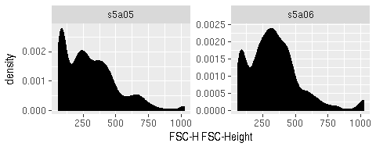
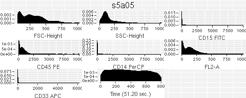
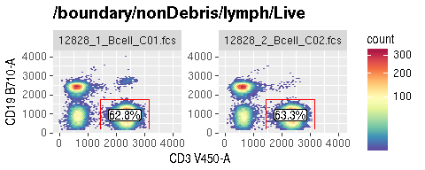
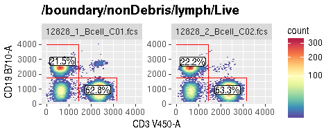

# Quick plot for cytometry data


```r
library(ggcyto)
dataDir <- system.file("extdata",package="flowWorkspaceData")
gs <- load_gs(list.files(dataDir, pattern = "gs_manual",full = TRUE))
data(GvHD)
fs <- GvHD[subset(pData(GvHD), Patient %in%5 & Visit %in% c(5:6))[["name"]]]
```

## `flowSet`
`geom_density` layer is used for one-dimensional plot.

```r
autoplot(fs, x = 'FSC-H')
```

 

`geom_hex` layer is added for 2d plot.

```r
autoplot(fs, x = 'FSC-H', y = 'SSC-H', bins = 64)
```

 

## `GatingSet` 

```r
autoplot(gs, "CD3+", bins = 64)
```

 

Here are some default settings applied:

* The instrument range is applied by default (through `ggcyto_par_set(limits = "instrument")`).
* "CD3" gate is plotted aganst its the parent population: "singlets"."
* Axis labels are inverse transformed through `axis_x_inverse_trans/axis_x_inverse_trans`.


Multiple gates that share the same parent can be plotted together.

```r
autoplot(gs, c("CD4", "CD8"), bins = 64)
```

 

## `GatingHierarchy`
Multiple cell populations with their asssociated gates can be plotted in different panels of the same plot.

```r
gh <- gs[[1]]
nodes <- getNodes(gh, path = "auto")[c(3:9, 14)]
nodes
```

```
## [1] "singlets"    "CD3+"        "CD4"         "CD4/38- DR+" "CD4/38+ DR+"
## [6] "CD4/38+ DR-" "CD4/38- DR-" "CD8"
```

```r
autoplot(gh, nodes, bins = 64)
```

 

Optionally we can disable default `grid.arrange` behavior and receive a list of ggplot objects instead and manually arrange these individual `ggplot` objects.

```r
objs <- autoplot(gh, nodes, bins = 64, arrange = FALSE)
length(objs)
```

```
## [1] 4
```

```r
class(objs[[1]])
```

```
## [1] "ggcyto_GatingSet"
## attr(,"package")
## [1] "ggcyto"
```

```r
class(objs[[2]])
```

```
## [1] "ggcyto_GatingSet"
## attr(,"package")
## [1] "ggcyto"
```

