# Visualize flowSet with ggcyto


```r
library(ggcyto)
data(GvHD)
fs <- GvHD[subset(pData(GvHD), Patient %in%5:7 & Visit %in% c(5:6))[["name"]]]
fr <- fs[[1]]
```

### 1d histogram/densityplot
`ggcyto` wrapper will construct the `ggcyto` object that inherits from `ggplot` class.

```r
p <- ggcyto(fs, aes(x = `FSC-H`)) 
class(p)
```

```
## [1] "ggcyto_flowSet"
## attr(,"package")
## [1] "ggcyto"
```

```r
is(p, "ggplot")
```

```
## [1] TRUE
```

Since only one dimension is specified, we can add any 1d geom layer

```r
p1 <- p + geom_histogram() 
p1
```

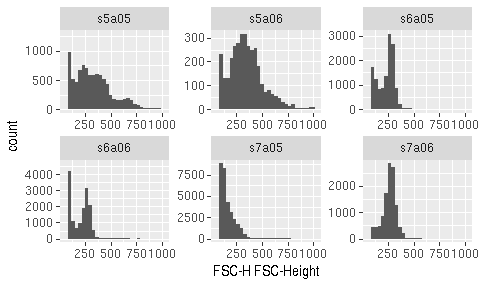 

As shown, data is facetted by samples name automatically (i.e `facet_wrap(~name)`).

We can overwrite the default faceting by any variables that are defined in `pData`

```r
pData(fs)
```

```
##       Patient Visit Days Grade  name
## s5a05       5     5   19     3 s5a05
## s5a06       5     6   26     3 s5a06
## s6a05       6     5   19     3 s6a05
## s6a06       6     6   27     3 s6a06
## s7a05       7     5   21     3 s7a05
## s7a06       7     6   28     3 s7a06
```

```r
p1 + facet_grid(Patient~Visit)
```

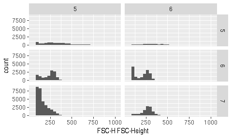 

To display 1d density

```r
p + geom_density()
```

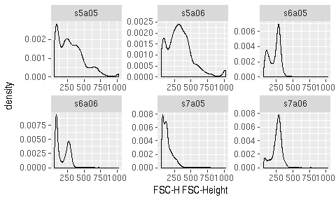 

Fill the same color

```r
p + geom_density(fill = "black")
```

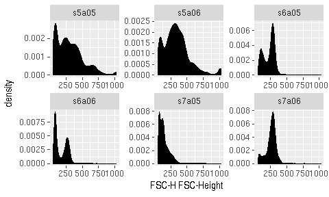 

Fill different colors

```r
ggcyto(fs, aes(x = `FSC-H`, fill = name)) + geom_density(alpha = 0.2)
```

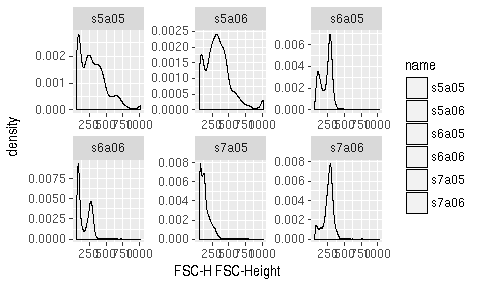 

Or plot in the same panel by using `ggplot` directly (thus removing the default facetting effect)

```r
ggplot(fs, aes(x = `FSC-H`, fill = name)) + geom_density(alpha = 0.2)
```

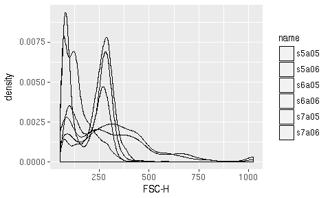 

### 2d scatter/dot plot

```r
# 2d hex
p <- ggcyto(fs, aes(x = `FSC-H`, y =  `SSC-H`))
p <- p + geom_hex(bins = 128)
p
```

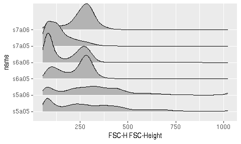 

A default `scale_fill_gradientn` is applied to 2d hexbin plot.

To add limits

```r
p <- p + ylim(c(10,9e2)) + xlim(c(10,9e2))   
p
```

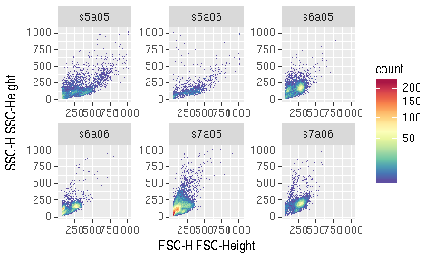 

To overwrite the default fill gradien

```r
p + scale_fill_gradientn(colours = rainbow(7), trans = "sqrt")
```

 

```r
p + scale_fill_gradient(trans = "sqrt", low = "gray", high = "black")
```

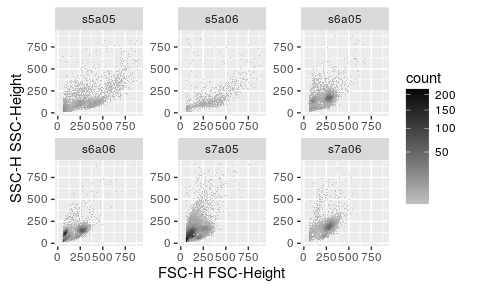 

### Add `geom_gate` and `geom_stats` layers

Firstly we create the `polygonGate` with a data-driven method provided by `flowStats` package.

```r
# estimate a lymphGate
lg <- flowStats::lymphGate(fr, channels=c("FSC-H", "SSC-H"),scale=0.6)
norm.filter <- lg$n2gate
#fit norm2 filter to multiple samples
fres <- filter(fs, norm.filter)
#extract the polygonGate for each sample
poly.gates <- lapply(fres, function(res)flowViz:::norm2Polygon(filterDetails(res, "defaultLymphGate")))
poly.gates
```

```
## $s5a05
## Polygonal gate 'defaultPolygonGate' with 50 vertices in dimensions FSC-H and SSC-H
## 
## $s5a06
## Polygonal gate 'defaultPolygonGate' with 50 vertices in dimensions FSC-H and SSC-H
## 
## $s6a05
## Polygonal gate 'defaultPolygonGate' with 50 vertices in dimensions FSC-H and SSC-H
## 
## $s6a06
## Polygonal gate 'defaultPolygonGate' with 50 vertices in dimensions FSC-H and SSC-H
## 
## $s7a05
## Polygonal gate 'defaultPolygonGate' with 50 vertices in dimensions FSC-H and SSC-H
## 
## $s7a06
## Polygonal gate 'defaultPolygonGate' with 50 vertices in dimensions FSC-H and SSC-H
```

Then pass the gates to the gate layer

```r
p + geom_gate(poly.gates)
```

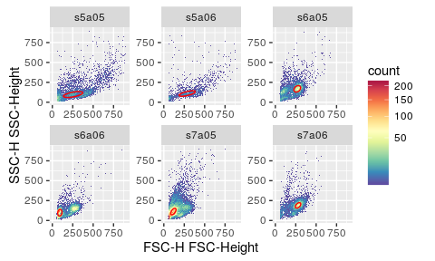 

We can also plot the `rectangleGate`, this time we simply replicate a static gate across samples:

```r
rect.g <- rectangleGate(list("FSC-H" =  c(300,500), "SSC-H" = c(50,200)))
rect.gates <- sapply(sampleNames(fs), function(sn)rect.g)
```

Similarly, supply the list of gates to the `geom_gate` layer

```r
p + geom_gate(rect.gates)
```

 

Stats layer can be added on top of gate

```r
p + geom_gate(rect.gates) + geom_stats(size = 3)
```

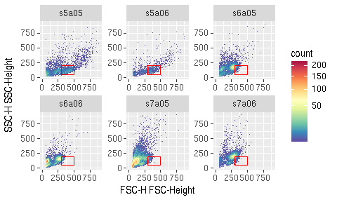 

The `percentage` of the gated population over its parent is displayed as `geom_label`. Alternatively cell `count` can be displayed by setting `type` argument in `geom_stats` function.

Here is another example of displaying the 1d gate generated by the automated gating method `mindensity` from `openCyto` package.

```r
den.gates.x <- fsApply(fs, openCyto::mindensity, channel = "FSC-H", gate_range = c(100, 300), adjust = 1)
p + geom_gate(den.gates.x) + geom_stats()
```

 

`geom_gate` layer supports the 1d gate on either dimension, which means it automatically determines between the vertical or horizontal lines based on the gate dimension and given `aes`.

```r
den.gates.y <- fsApply(fs, openCyto::mindensity, channel = "SSC-H", gate_range = c(100, 500), adjust = 1, positive = FALSE)

p + geom_gate(den.gates.y) + geom_stats(value = lapply(rect.gates, function(g)0.1))
```

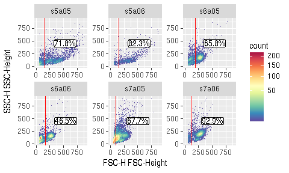 

Here we also demenstrated the option of passing the precalculated arbitary stats value to `geom_stats` lay instead of letting it compute on the fly, 

We can also put the 1d gate on density plot

```r
ggcyto(fs, aes(x = `FSC-H`)) + geom_density(fill = "black", aes(y = ..scaled..)) + geom_gate(den.gates.x)  + geom_stats(type = "count")
```

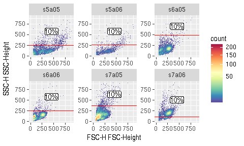 

Without supplying `data` for `geom_stats`, we add stats layer for all the gate layers implicitly

```r
p + geom_gate(poly.gates) + geom_gate(rect.gates) + geom_stats(size = 3)
```

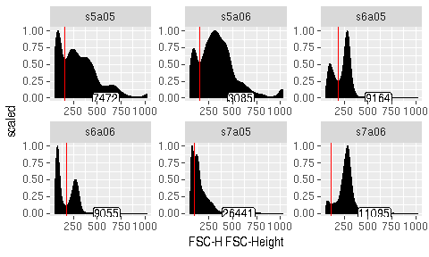 


Or we can add stats layer specificly just for one of the gate layer

```r
p + geom_gate(poly.gates) + geom_gate(rect.gates) + geom_stats(gate = poly.gates, size = 3)
```

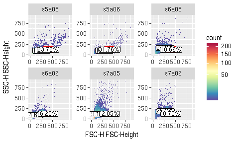 


Although `ggcyto` object is fully ggplot-compatible in terms of adding layers and parameters, its data slot MAY NOT be fully fortified to data.frame before it is printed/plotted.

```r
class(p)
```

```
## [1] "ggcyto_flowSet"
## attr(,"package")
## [1] "ggcyto"
```

```r
class(p$data)
```

```
## [1] "flowSet"
## attr(,"package")
## [1] "flowCore"
```

To convert it to a pure ggplot object, use `as.ggplot` function:

```r
p <- as.ggplot(p)

class(p)
```

```
## [1] "gg"     "ggplot"
```

```r
class(p$data)
```

```
## [1] "data.table" "data.frame"
```


